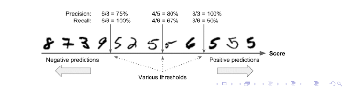

# Precision/Recall Tradeoff

Wynik F1 score faworyzuje klasyfikatory, które mają podobną precision i recall. To nie zawsze jest to, czego potrzebujesz: w niektórych kontekstach dbamy głównie o precision, a w innych kontekstach naprawdę zależy nam na recall.

Na przykład, jeśli wytrenowałeś klasyfikator do wykrywania filmów, które są bezpieczne dla dzieci, prawdopodobnie wolałbyś klasyfikator, który odrzuca wiele dobrych filmów (low recall), ale zachowuje tylko te bezpieczne (high precision).

Z drugiej strony, przypuśćmy, że uczymy klasyfikator, który wykrywa kieszonkowców na kamerach z monitoringu: prawdopodobnie dobrze jest jeśli klasyfikator ma niskie precision 30%, o ile ma 99% recall (na pewno strażnicy dostaną kilka fałszywych alarmów, ale prawie wszyscy złodzieje zostaną złapani).

Niestety nie możesz minimalizować ich obu: zwiększenie precision zmniejsza recall i na odwrót. Nazywa się to precision/recall tradeoff.

## Jak działa precision/recall tradeoff?

Aby zrozumieć ten kompromis, przyjrzyjmy się, w jaki sposób klasyfikator podejmuje decyzje dotyczące klasyfikacji. Dla każdego punktu oblicza funkcję decyzyjną, a jeśli ten wynik jest większy niż z góry ustawiony próg, przydziela ten element do klasy pozytywnej lub negatywnej.

Przypuśćmy, że próg decyzyjny znajduje się przy centralnej strzałce (pomiędzy dwoma piątkami):
- Mamy 4 prawdziwe piątki po prawej stronie tego progu i jedną fałszywą. Dlatego przy tym progu precision wynosi 80% (4 na 5).
- Ale z 6 rzeczywistych 5, klasyfikator wykrywa tylko 4, więc recall wynosi 67% (4 z 6).

Teraz, jeśli podniesiesz próg (przesuń go do strzałki po prawej), szósty wynik false positive staje się true negative, tym samym zwiększając precision (do 100% w tym przypadku), ale jeden wynik true positive staje się false negative, zmniejszając recall do 50%. I odwrotnie, obniżenie progu zwiększa recall i zmniejsza precision.

# ROC Curve

Receiver Operating Characteristic (ROC) jest kolejnym powszechnym narzędziem stosowanym w klasyfikatorach binarnych. Jest to bardzo podobne do krzywej precision/recall curve, ale zamiast opisywać relację między precision a recall, opisuje:
- Sensitivity (recall) vs 1-Specificity

Gdzie:
- Specificity = TN / (FP + TN)
- Recall = TP / (TP + FN)

Ponownie, im wyższe recall, tym więcej fałszywych alarmów specificity.

Linia przerywana przedstawia krzywą ROC czysto losowego klasyfikatora. Dobry klasyfikator daje krzywą jak najdalszą od tej. Jednym ze sposobów porównywania klasyfikatorów jest pomiar area under the curve (AUC). Idealny klasyfikator będzie miał ROC AUC równe 1, podczas gdy klasyfikator czysto losowy będzie miał ROC AUC równe 0.5.

# Definicje i Przykład Metryk Klasyfikacyjnych

## Accuracy (ACC)

**Accuracy** (dokładność) to miara wydajności klasyfikatora, określająca stosunek liczby poprawnie sklasyfikowanych próbek do całkowitej liczby próbek.

$$
\text{Accuracy} = \frac{\text{Liczba poprawnych predykcji}}{\text{Całkowita liczba próbek}}
$$

## Confusion Matrix

**Confusion Matrix** (macierz pomyłek) to tabela, która pozwala wizualizować wydajność algorytmu klasyfikacji. Składa się z czterech elementów:

- **TP (True Positive):** Liczba prawdziwie pozytywnych wyników.
- **TN (True Negative):** Liczba prawdziwie negatywnych wyników.
- **FP (False Positive):** Liczba fałszywie pozytywnych wyników.
- **FN (False Negative):** Liczba fałszywie negatywnych wyników.

|                        | Przewidywane Pozytywne | Przewidywane Negatywne |
|------------------------|------------------------|------------------------|
| **Rzeczywiste Pozytywne** | TP                     | FN                     |
| **Rzeczywiste Negatywne** | FP                     | TN                     |

## F1 Score

**F1 Score** to miara wydajności klasyfikatora, która jest średnią harmoniczną precyzji (precision) i czułości (recall).

$$
\text{F1 Score} = 2 \cdot \frac{\text{Precision} \cdot \text{Recall}}{\text{Precision} + \text{Recall}}
$$

Gdzie:
- **Precision** (precyzja) to stosunek liczby prawdziwie pozytywnych wyników do sumy prawdziwie pozytywnych i fałszywie pozytywnych wyników.

$$
\text{Precision} = \frac{TP}{TP + FP}
$$

- **Recall** (czułość) to stosunek liczby prawdziwie pozytywnych wyników do sumy prawdziwie pozytywnych i fałszywie negatywnych wyników.

$$
\text{Recall} = \frac{TP}{TP + FN}
$$

## Przykład

Załóżmy, że mamy zbiór danych testowych zawierający 10 próbek. Wyniki klasyfikacji są następujące:

- TP = 3 (prawdziwie pozytywne)
- TN = 4 (prawdziwie negatywne)
- FP = 1 (fałszywie pozytywne)
- FN = 2 (fałszywie negatywne)

### Obliczenia

1. **Accuracy (ACC):**

$$
\text{Accuracy} = \frac{TP + TN}{TP + TN + FP + FN} = \frac{3 + 4}{3 + 4 + 1 + 2} = \frac{7}{10} = 0.7
$$

2. **Confusion Matrix:**

|                        | Przewidywane Pozytywne | Przewidywane Negatywne |
|------------------------|------------------------|------------------------|
| **Rzeczywiste Pozytywne** | 3                      | 2                      |
| **Rzeczywiste Negatywne** | 1                      | 4                      |

3. **Precision:**

$$
\text{Precision} = \frac{TP}{TP + FP} = \frac{3}{3 + 1} = \frac{3}{4} = 0.75
$$

4. **Recall:**

$$
\text{Recall} = \frac{TP}{TP + FN} = \frac{3}{3 + 2} = \frac{3}{5} = 0.6
$$

5. **F1 Score:**

$$
\text{F1 Score} = 2 \cdot \frac{\text{Precision} \cdot \text{Recall}}{\text{Precision} + \text{Recall}} = 2 \cdot \frac{0.75 \cdot 0.6}{0.75 + 0.6} = 2 \cdot \frac{0.45}{1.35} = 2 \cdot 0.333 = 0.666
$$

### Podsumowanie

- **Accuracy:** 0.7
- **Precision:** 0.75
- **Recall:** 0.6
- **F1 Score:** 0.666

# Kiedy używać której miary oceny klasyfikatora

Wybór odpowiedniej miary oceny klasyfikatora zależy od specyfiki problemu i celów, jakie chcemy osiągnąć. Poniżej przedstawiono kilka kluczowych scenariuszy i rekomendacje dotyczące użycia różnych miar.

## Accuracy (Dokładność)

**Kiedy używać:**
- Gdy dane są zrównoważone, czyli liczba próbek w każdej klasie jest mniej więcej równa.
- Gdy koszt popełnienia błędu (fałszywie pozytywny vs fałszywie negatywny) jest taki sam dla obu typów błędów.

**Kiedy nie używać:**
- Gdy dane są niezbalansowane, czyli jedna klasa jest znacznie liczniejsza od drugiej.
- Gdy koszty popełnienia błędów są różne dla różnych klas.

## Confusion Matrix (Macierz Pomyłek)

**Kiedy używać:**
- Zawsze, gdy chcemy uzyskać szczegółowy przegląd wydajności klasyfikatora.
- Gdy ważne jest zrozumienie liczby prawdziwych pozytywów, prawdziwych negatywów, fałszywych pozytywów i fałszywych negatywów.
- Przy analizie niezbalansowanych danych, aby lepiej zrozumieć skutki popełnionych błędów.

**Kiedy nie używać:**
- Macierz pomyłek jest zawsze przydatna, ale sama w sobie nie jest wystarczająca do pełnej oceny modelu; zwykle jest używana w połączeniu z innymi miarami.

## Precision (Precyzja)

**Kiedy używać:**
- Gdy koszt fałszywie pozytywnych wyników jest wysoki.
- Gdy zależy nam na minimalizowaniu liczby błędnych alarmów (fałszywych pozytywów).

**Przykłady:**
- Wykrywanie spamu: Gdy wysyłanie fałszywie pozytywnych wiadomości do folderu spamu jest kosztowne.
- Diagnostyka medyczna: Gdy fałszywie pozytywna diagnoza może prowadzić do niepotrzebnych i potencjalnie szkodliwych dalszych testów.

## Recall (Czułość)

**Kiedy używać:**
- Gdy koszt fałszywie negatywnych wyników jest wysoki.
- Gdy zależy nam na maksymalnym wykryciu wszystkich pozytywnych przypadków.

**Przykłady:**
- Wykrywanie chorób: Gdy przeoczenie prawdziwie pozytywnego przypadku (fałszywie negatywne) jest bardzo kosztowne.
- Systemy bezpieczeństwa: Gdy niezauważenie zagrożenia może mieć poważne konsekwencje.

## F1 Score

**Kiedy używać:**
- Gdy dane są niezbalansowane i ważne jest zbalansowanie pomiędzy precyzją a czułością.
- Gdy zarówno fałszywie pozytywne, jak i fałszywie negatywne wyniki są kosztowne i chcemy osiągnąć kompromis.

**Kiedy nie używać:**
- Gdy dokładność samodzielnie jest wystarczająca (np. w dobrze zbalansowanych zbiorach danych z równymi kosztami błędów).

## Przykłady

### Przykład 1: Wykrywanie Spamu

- **Scenariusz:** Chcemy klasyfikować e-maile jako spam (1) lub nie-spam (0).
- **Ważne miary:**
  - **Precision:** Ważne, aby zminimalizować fałszywie pozytywne (nie-spam zaklasyfikowany jako spam), aby nie przegapić ważnych wiadomości.
  - **Recall:** Ważne, aby zidentyfikować jak najwięcej spamu.

### Przykład 2: Diagnostyka Medyczna

- **Scenariusz:** Chcemy zidentyfikować chorobę u pacjentów.
- **Ważne miary:**
  - **Recall:** Ważne, aby wykryć wszystkie przypadki choroby (fałszywie negatywne mogą być bardzo kosztowne).
  - **F1 Score:** Ważne, aby zrównoważyć precyzję i czułość, jeśli fałszywie pozytywne diagnozy również są kosztowne.

### Przykład 3: Systemy Bezpieczeństwa

- **Scenariusz:** Chcemy wykryć zagrożenia bezpieczeństwa (np. intruzów).
- **Ważne miary:**
  - **Recall:** Ważne, aby wykryć wszystkie zagrożenia (fałszywie negatywne mogą być bardzo kosztowne).
  - **Precision:** Ważne, aby zminimalizować fałszywe alarmy (fałszywie pozytywne), które mogą powodować niepotrzebne interwencje.

# ROC Curve

Receiver Operating Characteristic (ROC) jest kolejnym powszechnym narzędziem stosowanym w klasyfikatorach binarnych. Jest to bardzo podobne do krzywej precision/recall curve, ale zamiast opisywać relację między precision a recall, opisuje:
- Sensitivity (recall) vs 1-Specificity

Gdzie:
- Specificity = TN / (FP + TN)
- Recall = TP / (TP + FN)

Ponownie, im wyższe recall, tym więcej fałszywych alarmów specificity.

Linia przerywana przedstawia krzywą ROC czysto losowego klasyfikatora. Dobry klasyfikator daje krzywą jak najdalszą od tej. Jednym ze sposobów porównywania klasyfikatorów jest pomiar area under the curve (AUC). Idealny klasyfikator będzie miał ROC AUC równe 1, podczas gdy klasyfikator czysto losowy będzie miał ROC AUC równe 0.5.

## Kiedy używać ROC Curve?

- **Gdy dane są niezbalansowane:** Krzywa ROC dobrze radzi sobie z niezbalansowanymi danymi, ponieważ uwzględnia zarówno czułość, jak i specyficzność.
- **Ocena różnych progów:** Gdy chcesz ocenić wydajność klasyfikatora przy różnych progach decyzyjnych.
- **Porównanie klasyfikatorów:** Gdy chcesz porównać ogólną wydajność różnych klasyfikatorów niezależnie od wybranego progu.
- **Zrozumienie kompromisu między czułością a specyficznością:** Gdy chcesz zrozumieć, jak zmiana progu wpływa na czułość i specyficzność klasyfikatora.

## Kiedy nie używać ROC Curve?

- **Gdy zależy Ci głównie na precyzji:** Jeśli precyzja jest dla Ciebie ważniejsza niż czułość (np. w przypadku wykrywania spamu, gdzie fałszywe alarmy są kosztowne), krzywa ROC może nie być najlepszym narzędziem.
- **Gdy dane są skrajnie niezbalansowane:** W przypadkach, gdy klasa pozytywna jest bardzo rzadka, krzywa ROC może nie dostarczyć wystarczająco szczegółowych informacji na temat wydajności klasyfikatora w kontekście wysokiego poziomu fałszywych alarmów.
- **Gdy koszty fałszywie pozytywnych i fałszywie negatywnych wyników są bardzo różne:** Jeśli konsekwencje fałszywych pozytywów są znacznie bardziej kosztowne niż fałszywych negatywów (lub odwrotnie), inne miary, takie jak precision-recall curve, mogą być bardziej odpowiednie.

## Przykład użycia krzywej ROC

Załóżmy, że mamy klasyfikator binarny, który przewiduje, czy dana wiadomość e-mail jest spamem. Obliczamy czułość i specyficzność dla różnych progów decyzyjnych i rysujemy krzywą ROC, aby zobaczyć, jak dobrze klasyfikator radzi sobie z oddzielaniem spamu od niespamu.

## Podsumowanie

Każda miara ma swoje zalety i wady, a wybór odpowiedniej zależy od specyficznych potrzeb i kontekstu zastosowania. W praktyce, często używa się kilku miar jednocześnie, aby uzyskać pełny obraz wydajności klasyfikatora.
