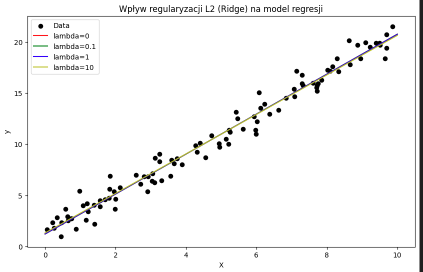

# Regularyzacja

**Regularyzacja** to technika stosowana w statystyce i uczeniu maszynowym, która ma na celu poprawę ogólnej zdolności modelu do generalizacji poprzez dodanie kary za złożoność modelu. W praktyce regularyzacja pomaga zapobiegać nadmiernemu dopasowaniu (overfitting), które występuje, gdy model zbyt dokładnie dopasowuje się do danych treningowych, ale działa słabo na nowych, niewidzianych danych.

## Główne typy regularyzacji

1. **Regularyzacja L1 (Lasso)**
2. **Regularyzacja L2 (Ridge)**
3. **Elastic Net** (połączenie L1 i L2)

## Regularyzacja L1 (Lasso)

Regularyzacja L1 dodaje karę równą sumie wartości bezwzględnych współczynników regresji do funkcji kosztu. Matematycznie, regularyzacja L1 jest wyrażona jako:

$$
\text{Koszt L1} = \text{RSS} + \lambda \sum_{j=1}^p |\beta_j|
$$

Gdzie:

- RSS to suma kwadratów reszt (residual sum of squares).
- lambda to parametr regularyzacji, który kontroluje siłę kary.
- beta_j to współczynniki modelu regresji.

## Regularyzacja L2 (Ridge)

Regularyzacja L2 dodaje karę równą sumie kwadratów współczynników regresji do funkcji kosztu. Matematycznie, regularyzacja L2 jest wyrażona jako:

$$
\text{Koszt L2} = \text{RSS} + \lambda \sum_{j=1}^p \beta_j^2
$$

Gdzie:
- \(\text{RSS}\) to suma kwadratów reszt.
- \(\lambda\) to parametr regularyzacji, który kontroluje siłę kary.
- \(\beta_j\) to współczynniki modelu regresji.

## Elastic Net

Elastic Net łączy cechy zarówno regularyzacji L1, jak i L2, dodając do funkcji kosztu zarówno sumę wartości bezwzględnych, jak i sumę kwadratów współczynników regresji:

$$
\text{Koszt Elastic Net} = \text{RSS} + \lambda_1 \sum_{j=1}^p |\beta_j| + \lambda_2 \sum_{j=1}^p \beta_j^2
$$


Gdzie:
- \(\text{RSS}\) to suma kwadratów reszt (residual sum of squares).
- \(\lambda\) to parametr regularyzacji, który kontroluje siłę kary.
- \(\beta_j\) to współczynniki modelu regresji.


## Przykład wizualny

Aby lepiej zrozumieć wpływ regularyzacji na model, spójrzmy na prosty przykład regresji liniowej z różnymi wartościami \(\lambda\). Poniżej znajduje się kod w Pythonie, który ilustruje wpływ regularyzacji L2 (Ridge) na dopasowanie modelu:

```python
import numpy as np
import matplotlib.pyplot as plt
from sklearn.linear_model import Ridge

# Generowanie danych
np.random.seed(42)
X = np.random.rand(100, 1) * 10
y = 2 * X + 1 + np.random.randn(100, 1)

# Tworzenie modelu Ridge z różnymi wartościami lambda
lambdas = [0, 0.1, 1, 10]
models = [Ridge(alpha=l, fit_intercept=True) for l in lambdas]
colors = ['r', 'g', 'b', 'y']
labels = [f'lambda={l}' for l in lambdas]

# Trening modeli
for model in models:
    model.fit(X, y)

# Rysowanie wykresu
plt.figure(figsize=(10, 6))
plt.scatter(X, y, color='black', label='Data')

# Rysowanie linii regresji
x_range = np.linspace(0, 10, 100).reshape(-1, 1)
for model, color, label in zip(models, colors, labels):
    y_pred = model.predict(x_range)
    plt.plot(x_range, y_pred, color=color, label=label)

plt.xlabel('X')
plt.ylabel('y')
plt.legend()
plt.title('Wpływ regularyzacji L2 (Ridge) na model regresji')
plt.show()
```

