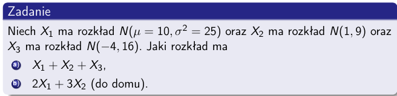

### Obliczenia dla kombinacji zmiennych losowych

Dane:
- $X_1 \sim N(10, 25)$, więc $\mu_{X_1} = 10$ i $\sigma^2_{X_1} = 25$.
- $X_2 \sim N(1, 9)$, więc $\mu_{X_2} = 1$ i $\sigma^2_{X_2} = 9$.
- $X_3 \sim N(-4, 16)$, więc $\mu_{X_3} = -4$ i $\sigma^2_{X_3} = 16$.

#### a) Dla $X_1 + X_2 + X_3$

- Średnia ($\mu$): Suma średnich zmiennych, więc $\mu = \mu_{X_1} + \mu_{X_2} + \mu_{X_3} = 10 + 1 - 4 = 7$.
- Wariancja ($\sigma^2$): Suma wariancji zmiennych, więc $\sigma^2 = \sigma^2_{X_1} + \sigma^2_{X_2} + \sigma^2_{X_3} = 25 + 9 + 16 = 50$.

Rozkład $X_1 + X_2 + X_3$ to $N(7, 50)$.

#### b) Dla $2X_1 + 3X_2$

- Średnia ($\mu$): Średnia ważona, więc $\mu = 2\mu_{X_1} + 3\mu_{X_2} = 2 \cdot 10 + 3 \cdot 1 = 23$.
- Wariancja ($\sigma^2$): Dla ważonych zmiennych, wariancja to suma kwadratów wag pomnożonych przez odpowiadające im wariancje zmiennych, więc $\sigma^2 = 4\sigma^2_{X_1} + 9\sigma^2_{X_2} = 4 \cdot 25 + 9 \cdot 9 = 181$.

Rozkład $2X_1 + 3X_2$ to $N(23, 181)$.
